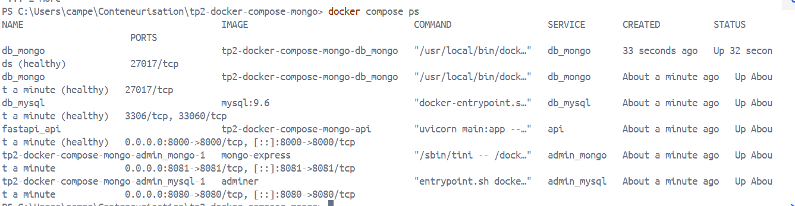
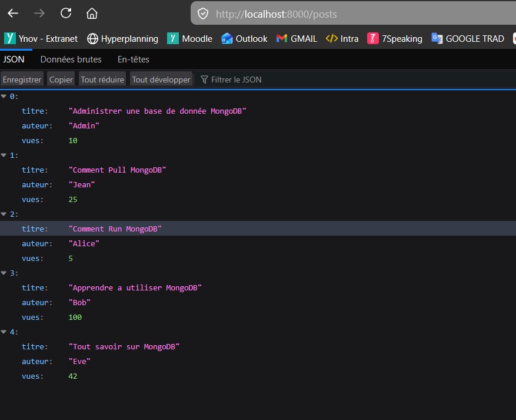
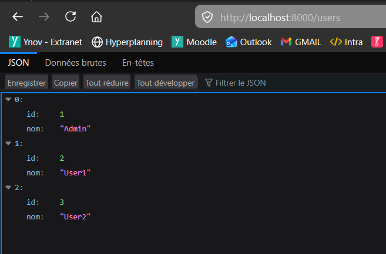

# Activité 2 : Orchestration d'une Stack Hybride (FastAPI, MongoDB, MySQL)

Ce projet déploie une architecture multi-services orchestrée par Docker Compose. Elle combine une base de données NoSQL (MongoDB) et une base SQL (MySQL), pilotées par une API FastAPI.

## Architecture des Services
1. db_mongo : MongoDB (Image personnalisée, utilisateur non-root, validation de schéma).
2. db_mysql : MySQL 9.6 (Image officielle avec script d'initialisation).
3. api : Backend FastAPI (Python 3.11-slim) faisant le pont entre les deux bases.
4. admin_mongo : Interface Mongo-Express pour la gestion de MongoDB.
5. admin_mysql : Interface Adminer pour la gestion de MySQL.

## Configuration et Lancement
1. Créer un fichier .env à la racine du projet en vous basant sur le modele .env.example.
2. Lancer l'infrastructure avec la commande suivante :
```bash
   docker compose up -d --build
```

## Contraintes Techniques Respectées
- Politique de redémarrage : restart: on-failure configuré sur tous les services.
- Dépendances : L'API ne démarre que lorsque db_mongo et db_mysql sont déclarées "healthy".
- Healthchecks :
  - MongoDB : Vérification du nombre de documents (5).
  - MySQL : Vérification de la présence de la table utilisateurs.
  - API : Vérification de la disponibilité des routes /posts et /users.
- Sécurite : Utilisation d'utilisateurs non-root pour MongoDB et l'API.

## Preuves de fonctionnement

### État des services (Docker PS)
Tous les services sont démarrés et les tests de santé (healthchecks) sont valides.


### Route MongoDB (/posts)
Récupération réussie des articles de test depuis MongoDB.


### Route MySQL (/users)
Récupération réussie des utilisateurs depuis MySQL.


## Sécurité et Optimisation
- .gitignore et .dockerignore : Utilisés pour exclure les fichiers sensibles (.env) et les dossiers inutiles (__pycache__, venv).
- Volumes nommés : Garantissent la persistance des données pour MongoDB et MySQL.